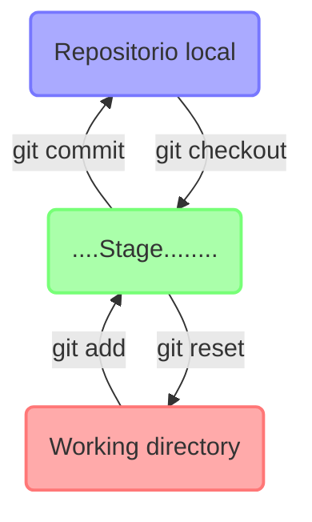
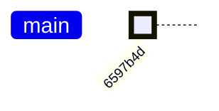
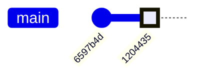
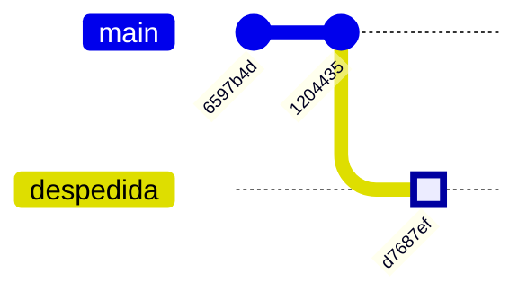
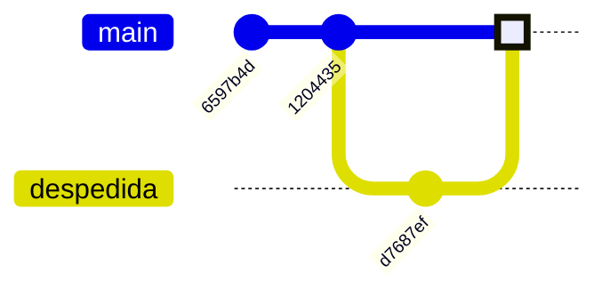

> Git es un sistema de control de cambios que permite llevar registro de modificaciones realizadas en los archivos de un repositorio, asi como facilitar la colaboración entre otras cosas.
 

## Git (local)

En esta primera parte vamos a ver como utilizar Git de forma local (sin acceder a servidores remotos como github ó gitlab).


### Iniciar un repositorio:

Para comenzar a utilizar git es necesario ir a una carpeta donde se quiere producir el respositorio e iniciar git con:
```shell
$ git init
Initialized empty Git repository in /home/usuario/test_git/.git/
```
Git nos dice que se creo un repositorio (vacío).

Antes de seguír veamos como se estructura nuestro ambiente de desarrollo local:
- **Directorio de trabajo** ó *Working directory*: es el espacio donde trabajamos y modificamos nuestros archivos. En este espacio Git no trackea ni guarda modificaciones. Es decir si algo se modifica ó pierde dentro de este espacio no hay forma de recuperarlo.
- *Stage* (también conocido como Index). Es un espacio intermedio entre el *working directory* y el *History*, acá pondemos archivos temporalmente que luego van a actualizar el estado del repositorio.
- *History* ó **repositorio local**, este es el espacio más importante. Acá es donde se van a ir almacenando sucesivas "versiones" ó estados del repositorio que llamaremos *commits*. Cada vez que envíamos uno ó un grupo de archivos al *History* (decimos que hacemos un *commit*) actualizamos el estado del proyecto y se crea una nueva "fotografía" del repositorio. Esta fotografía representa el estado del repositorio de ese momento y que luego puede ser utilizada para comparar con las versiones anteriores y posteriores del repositorio (entre otras cosas).

Sé que al principio esto puede resultar bastante abstracto, pero a medida que usemos Git vamos a entender cual es la función de cada espacio. 


Lo primero a resolver es como mover archivos de un espacio a otro, para eso hay una serie de comandos:
- `git add <archivos>` copia los archivos en su estado actual del directorio de trabajo al *stage*.
- `git commit` lleva los archivos del *stage* al *history* (crea un nuevo *commit*).
- `git reset <archivos>` saca del *stage* un archivo, es decir lo copia del último commit y lo pone en el *stage*. 
- `git checkout <archivos>` copia los archivos desde el *stage* al directorio de trabajo. Sirve para descartar cambios locales.

A continuación vamos a construir un ejemplo para ver estos comandos en práctica.

### Agregar archivo al stage
En nuestro repositorio vacío, vamos a crear un archivo con algún contenido y luego lo llevaremos al *stage*:

```shell
$ cat "Hola mundi" > saludo.txt
$ git add saludo.txt
```

### Ver estado de repositorio
Un comando muy útil es `git status`, este te permite conocer en que estado se encuentra el *working directory* yel *stage*:

```shell
$ git status
On branch master

No commits yet

Changes to be committed:
  (use "git rm --cached <file>..." to unstage)
	new file:   saludo.txt
```
El comando nos está diciendo que estamos en la rama (ó *branch*) "master" (a veces se llama main), que no hay commits aún (es decir que el history está vacío) y que hay un archivo nuevo "saludo.txt" en el stage.

### Hacer un commit

Para llevar el archivo al *history* usamos el comando `git commit`:

```git
$ git commit -m "agrego archivo saludo.txt"
[master (root-commit) 6597b4d] agrego archivo saludo.txt
 1 file changed, 1 insertion(+)
 create mode 100644 saludo.txt
```
generalmente `git commit` se ejecuta con la opción `-m` que sirve para dejar un mensaje o descripción del cambio que se realizó.

Este commit será el primer *nodo* (estado ó "fotografía") dentro del repositorio local:


Notar que a cada "commit" se le asigna un *hash* (ó id) que lo identifica, en este ejemplo es: "6597b4d".

Si corremos `git status` obtenemos:
```git
$ git status
On branch master
nothing to commit, working tree clean
```
nos dice que no hay nada para "commitear" (nada en el *stage*) y que el directorio de trabajo está limpio (nada en el *working directory*).


Vamos a generar ahora un nuevo commit, corrigiendo el error que habia en el archivo saludo.txt (decía "Hola mundi" en lugar de "Hola mundo"), y luego vamos a crear un nuevo commit con el archivo modificado:

```shell
$ echo "Hola mundo" > saludo.txt
$ git add saludo.txt
$ git commit -m "corrección ortográfica"
[master 1204435] corrección ortográfica
 1 file changed, 1 insertion(+), 1 deletion(-)
``` 

Ahora nuestro repositorio consiste en dos *commits* ó fotografías:


### Ver historia del repostorio

Para visualizar el estado del repositorio local usamos el comando `git log`:
```shell
$ git log --oneline
1204435 (HEAD -> master) corrección ortográfica
6597b4d agrego archivo saludo.txt
```
el comando nos muestra los dos commits que hicimos, con su correspondiente descripción. Además nos indica que el "cabezal" (**HEAD**) está posicionado en el commit `1204435`, en este caso en el último commit que hicimos. El HEAD representa nuestra posición en el repositorio.


### Navegar por el repositorio

Si queremos ir a ver una versión anterior podemos usar el commando `git checkout <hash>`:
```shell
$ git checkout 6597b4d
```

Para verificar nuestra posición podemos usar `git log` :
```shell
$ git log --oneline --all
1204435 (master) corrección ortográfica
6597b4d (HEAD) agrego archivo saludo.txt
$ cat saludo.txt 
Hola mundi
```
vemos que ahora el HEAD está en el commit anterior. Incluso el archivo que cambiamos volvio a su versión previa, es decir tenemos en el directorio de trabajo la versión de los archivos del commit en el que estamos. 

Para volver a la última versión del repositorio lo hacemos con `git checkout`:
```shell
$ git checkout 1204435
```
ó alternativamente usando el nombre de la rama a la que queremos ir (en nuestro caso master es el único branch):
```shell
$ git checkout master
```


### Crear branch

Ya vimos como crear nuevos commits, y como movernos en el repositorio, ahora exploremos una característica importante de `git` que es la posibilidad de generar ramificaciones (*branches*) en el repositorio:

Supongamos que queremos producir una rama paralela de este (inútil) proyecto que contenga un archivo de despedida.

Primero tenemos que generar una rama nueva, esto se puede realizar con el comando `git checkout -b <nueva_rama>`:

```shell
$ git checkout -b "despedida"
Switched to a new branch 'despedida'
```

Hacemos las modificaciones:
```shell
$ echo "Chau mundo" > despedida.txt
$ git add 
$ git commit -m "agregar despedida.txt"
[despedida d7687ef] agregar despedida.txt
 1 file changed, 1 insertion(+), 1 deletion(-)
```

Con `git log --oneline --all` vamos a poder ver como queda nuestro repositorio.



### Merge:

Ahora supongamos que queremos incorporar nuestra modificación al branch principal, para esto tenemos que "unir" los dos branches usando el comando `git merge`.

Lo primero que hacemos es volver a nuestro branch principal y luego lo "mergeamos" con el branch nuevo (`despedida`):
```shell
$ git checkout master
$ git merge -b despedida
```

La estructura de nuestro repositorio ahora es:



### `git cherry pick`

A veces queremos traer de otro branch no la totalidad de las modificaciones, sino tan solo un commit en particular. Para esto existe el comando `git cherry pick`

cherry-pick "copia" un commit, creando un nuevo commit en el branch donde estamos parados con el mismo mensaje que el otro commit.

### `git rebase`

Aveces ocurre que abrimos un branch, lo empezamos a trabajar y en paralelo el otros branches siguen avanzando de forma tal que el nuestro queda desactualizado. En cierto punto quizá querramos traer toda las modificaciones que se hicieron en el resto de las ramas, sin que esto implique hacer un `merge` ya que nuestro branch puede no estar finalizado. Para casos como este podemos usar `git rebase` 


Se puede pensar a `rebase` como una forma corta de hacer sucesivos `cherry pick`.

### `git diff`

Para comparar dos commits podemos existe el comando `git diff`:

```shell
$ git diff master master~2
```

También podemos usar git diff para comparar los archivos del directorio de trabajo con el último commit simplemente usando `git diff` (sin argumentos).


### `git stash`

Si tenemos archivos modificados en el directorio de trabajo y queremos ir a revisar un commit viejo, al intentar ir nos git va a tener un conflicto de versiones (ya que al hacer `checkout` git trae al directorio de trabajo la versión del commit al que vamos). En estos casos tenemos dos alternativas:
- hacemos un nuevo commit con los cambios actuales (aunque estén a medio hacer)
- ó podemos usar `git stash` para guardar estos archivos temporalmente en un espacio aparte, ir a revisar otras versiones, despues volver y recuperar nuestro trabajo del stash.

```shell
$ echo "cosa nueva.." >> saludo.txt
$ git stash
Saved working directory and index state WIP on master: d484fef agregar archivo despedida.txt
```

si hacemos `git status` vamos a ver que no hay nada en el working directory ni en el stage, por lo que es seguro ir a visitar viejos commits.

Si queremos ver las cosas que tenemos guardadas en el stash usamos: `git stash --list`.

Para traer las modificaciones desde el stash al directorio de trabajo usamos  `git stash pop <stash_id>`. En nuestro caso `git stash pop stash@{0}`.

### Ver historial de cambios comandos usados

Para revisar los comandos que fueron ejecutados existe el commando `git reflog`:
```shell
$ git reflog
1204435 (HEAD -> master) HEAD@{2}: checkout: moving from 6597b4d to master
6597b4d HEAD@{3}: checkout: moving from master to 6597b4d
1204435 (HEAD -> master) HEAD@{4}: commit: corrección ortográfica
6597b4d HEAD@{5}: commit (initial): agrego archivo saludo.txt
```

---

## Git (remoto)

Clonar repositorio remoto:
```shell
git clone origin master
```

Crear respositorio remoto:
```shell
git remote
```

Llevar cambios a repositorio remoto:

```shell
git push
```

Traer objetos y referencias de repo remoto:
```shell
git fetch
```

Traer la version existente en repositorio remoto al repositorio local
```shell
git pull
```

es lo mismo que hacer:
```shell
git pull; git merge
```


--- 

## Avanzado:

Ir a commits antiguos y modificar historial, combinar commits, etc.

```shell
git rebase -i HEAD~N
```

### UNDO errores:

`git restore` sirve para recuperar archivos borrados, o modificados y dejarlos como en el ultimo commit.

```shell
git restore <archivo>
```

se puede usar de formar interactiva por *patches* con `git restore -p`


Modificar ultimo commit:
```shell
git commit --amend -m "correccion"
```

Borrar commits luego de cierto nivel, voy con checkout al lugar que quiero y luego
```shell
git reset --herd
```


Recuperar commits borrados:

```shell
git reflog
```

Recuperar branches borrados:
```shell
git reflog
```

### Customización:


+ `git config --global user.name <name>`
+ `git config --global user.email <email>`
+ `git config --global user.alias <alias-name> <git-command>`
+ `git config --system core.editor <editor>`


Para ver archivo de configuración, y editar variables:
+ `git config --global --edit`
+ `git config --local  --edit`
+ `git config --system --edit`


---

## Resumen Git command-line interface

- `git help <command>`: get help for a git command
- `git init`: creates a new git repo, with data stored in the `.git` directory
- `git status`: tells you what's going on
- `git add <filename>`: adds files to staging area
- `git commit`: creates a new commit
    - Write [good commit messages](https://tbaggery.com/2008/04/19/a-note-about-git-commit-messages.html)!
    - Even more reasons to write [good commit messages](https://chris.beams.io/posts/git-commit/)!
- `git log`: shows a flattened log of history
- `git log --all --graph --decorate`: visualizes history as a DAG
- `git diff <filename>`: show changes you made relative to the staging area
- `git diff <revision> <filename>`: shows differences in a file between snapshots
- `git checkout <revision>`: updates HEAD and current branch

## Branching and merging

- `git branch`: shows branches
- `git branch <name>`: creates a branch
- `git checkout -b <name>`: creates a branch and switches to it
    - same as `git branch <name>; git checkout <name>`
- `git merge <revision>`: merges into current branch
- `git mergetool`: use a fancy tool to help resolve merge conflicts
- `git rebase`: rebase set of patches onto a new base

## Remotes

- `git remote`: list remotes
- `git remote add <name> <url>`: add a remote
- `git push <remote> <local branch>:<remote branch>`: send objects to remote, and update remote reference
- `git branch --set-upstream-to=<remote>/<remote branch>`: set up correspondence between local and remote branch
- `git fetch`: retrieve objects/references from a remote
- `git pull`: same as `git fetch; git merge`
- `git clone`: download repository from remote

## Undo

- `git commit --amend`: edit a commit's contents/message
- `git reset HEAD <file>`: unstage a file
- `git checkout -- <file>`: discard changes

# Advanced Git

- `git config`: Git is [highly customizable](https://git-scm.com/docs/git-config)
- `git clone --depth=1`: shallow clone, without entire version history
- `git add -p`: interactive staging
- `git rebase -i`: interactive rebasing
- `git blame`: show who last edited which line
- `git stash`: temporarily remove modifications to working directory
- `git bisect`: binary search history (e.g. for regressions)
- `.gitignore`: [specify](https://git-scm.com/docs/gitignore) intentionally untracked files to ignore
