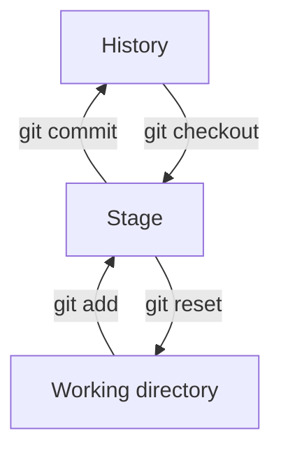
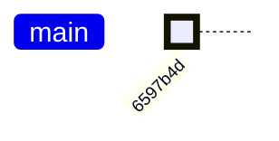
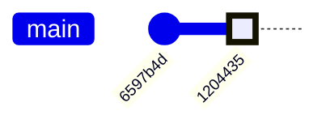
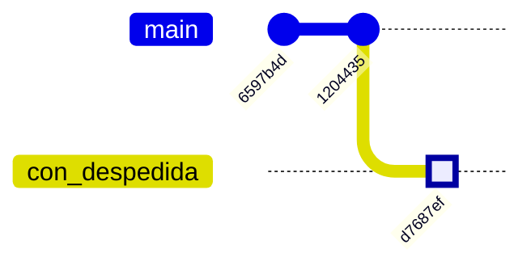
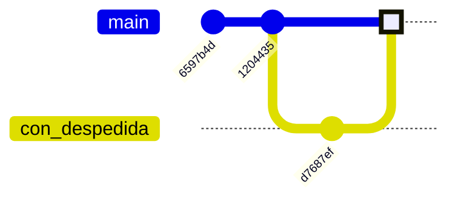

> Git es un sistema de control de cambios que permite llevar registro de modificaciones realizadas en los archivos de un repositorio, asi como facilitar la colaboración entre otras cosas.
 

## Git (local)

En esta primera parte vamos a ver como utilizar Git de forma local (sin acceder a servidores remotos como github ó gitlab).


### Iniciar un repositorio:

Para comenzar a utilizar git es necesario ir a una carpeta donde se quiere producir el respositorio e iniciar git con:
```shell
usuario@pc:~/test_git$ git init
Initialized empty Git repository in /home/usuario/test_git/.git/
```

Un repositorio (vacío) se generó.

Antes de seguír vamos a armarnos una imagen conceptual de cómo se estructura el repositorio, para poder entender como trabajar.

Un respositorio local tiene 3 partes ó etapas:
- Directorio de trabajo ó *Working directory*: es el espacio donde trabajamos, donde modificamos nuestros archivos. En este espacio git no trackea ni guarda modificaciones. Es decir si algo se modifica dentro de este espacio no hay forma de volver atrás.
- *Stage* (Index). Es un espacio intermedio entre el *working directory* y el *History*, acá se envían archivos temporalmente que luego serán parte del historial del repositorio.
- *History* ó repositorio local, este es el espacio donde se van a ir almacenando sucesivas "versiones" ó etapas del trabajo del repositorio. Cada vez que envíamos un grupo de archivos al *History* (decimos que hacemos un *commit*) se crea una nueva "fotografía" del repositorio, que luego puede ser utilizada para comparar con las versiones anteriores y posteriores del repositorio, entre otras cosas.

Al principio esto puede resultar bastante abstracto, pero a medida que vayamos usando Git va a ir quedando más claro. 


Hay comandos especificos que nos permiten mover archivos desde un espacio a otro.
- `git add <archivos>` copia los archivos en su estado actual al *stage*.
- `git commit` genera una nueva fotografía (*snapshot*) del *stage* en el *history*.
- `git reset <archivos>` saca del *stage* un archivo, es decir lo copia del último commit y lo pone en el *stage*. 
- `git checkout <archivos>` copia los archivos desde el *stage* al *working directory*. Sirve para descartar cambios locales.

A continuación vamos a ver basado en un ejemplo y con más detalle estos comandos.

### Agregar archivo al stage
Primero vamos a crear un archivo con algún contenido, y luego llevarlo al *stage*:

```shell
usuario@pc:~/test_git$ cat "Hola mundi" > saludo.txt
usuario@pc:~/test_git$ git add saludo.txt
```

### Ver estado de repositorio
Un comando muy útil es `git status`, este te permite conocer en que estado se encuentra el *working directory*:

```shell
usuario@pc:~/test_git$ git status
On branch master

No commits yet

Changes to be committed:
  (use "git rm --cached <file>..." to unstage)
	new file:   saludo.txt
```

El comando nos dice que estamos en la rama (*branch*) principal ó "master" (a veces se llama main), nos indica que no hay commits aún (es decir que el history está vacío) y que hay un archivo nuevo "saludo.txt" en el stage.

### Commit cambios

Para llevar el archivo al *history* tenemos que realizar un *commit*:

```git
usuario@pc:~/test_git$ git commit -m "agrego archivo saludo.txt"
[master (root-commit) 6597b4d] agrego archivo saludo.txt
 1 file changed, 1 insertion(+)
 create mode 100644 saludo.txt
```

generalmente `git commit` se ejecuta con la opción `-m` que sirve para dejar un mensaje o descripción del cambio que se realizó.

Recordemos la analogía de que cada commit es como una *fotografía* del repositorio que queda guardada en el repositorio.


Notar que a cada "commit" se le asigna un hash (ó id) que lo identifica, en este ejemplo es: "6597b4d".


Si corremos `git status` obtenemos:
```git
usuario@pc:~/test_git$ git status
On branch master
nothing to commit, working tree clean
```
nos dice que no hay nada para "comitear" (nada en el *stage*) y que el directorio de trabajo está limpio (nada en el *working directory*).


Vamos a generar ahora un nuevo commit, corrigiendo el error que habia en el archivo saludo.txt (decía "Hola mundi" en lugar de "Hola mundo"), y luego vamos a crear un nuevo commit con el archivo modificado:

```shell
usuario@pc:~/test_git$ echo "Hola mundo" > saludo.txt
usuario@pc:~/test_git$ git add saludo.txt
usuario@pc:~/test_git$ git commit -m "corrección ortográfica"
[master 1204435] corrección ortográfica
 1 file changed, 1 insertion(+), 1 deletion(-)
``` 

Ahora nuestro repositorio consiste en dos *commits* ó fotografías:


### Ver historia del repostorio

Aveces es útil poder ver el estado del repositorio, y saber cuales son los commits actuales y pasados, para ello existe el comando `git log` que nos muestra la estructura del repositorio:
```shell
usuario@pc:~/test_git$ git log --oneline
1204435 (HEAD -> master) corrección ortográfica
6597b4d agrego archivo saludo.txt
```
el comando nos muestra los dos commits que hicimos, con su correspondiente descripción, y además nos indica que el "cabezal" (**HEAD**) está posicionado en el commit `1204435`, es decir, en el último commit que hicimos.

Si queremos ir a ver una versión anterior podemos usar el commando `git checkout`:
```shell
usuario@pc:~/test_git$ git checkout 6597b4d
```

Ahora si hacemos `git log` veremos que estamos parados con el HEAD en el commit anterior:
```shell
usuario@pc:~/test_git$ git log --oneline --all
1204435 (master) corrección ortográfica
6597b4d (HEAD) agrego archivo saludo.txt
usuario@pc:~/test_git$ cat saludo.txt 
Hola mundi
```
notar que incluso el archivo que cambiamos volvio a su versión previa.

Para volver a la última versión del repositorio lo hacemos con `git commit`:
```shell
usuario@pc:~/test_git$ git checkout 1204435
```
ó alternativamente:
```shell
usuario@pc:~/test_git$ git checkout master
```

### Ver historial de cambios comandos usados

Para revisar los comandos que fueron ejecutados existe el commando `git reflog`:
```shell
usuario@pc:~/test_git$ git reflog
1204435 (HEAD -> master) HEAD@{2}: checkout: moving from 6597b4d to master
6597b4d HEAD@{3}: checkout: moving from master to 6597b4d
1204435 (HEAD -> master) HEAD@{4}: commit: corrección ortográfica
6597b4d HEAD@{5}: commit (initial): agrego archivo saludo.txt
```

### Crear branch

Ya vimos como crear nuevos commits, y como movernos en el repositorio, ahora exploremos una característica importante de `git` que es la posibilidad de generar ramificaciones (*branches*) en el repositorio:

Supongamos que queremos producir una rama paralela de este (inútil) proyecto pero en otro idioma.

Primero tenemos que generar una rama nueva, esto se puede realizar con el comando:

```shell
usuario@pc:~/test_git$ git checkout -b "con_despedida"
git checkout -b castellano
Switched to a new branch 'con_despedida'
```

Hacemos las modificaciones:
```shell
usuario@pc:~/test_git$ echo "Hola mundo" > saludo.txt
usuario@pc:~/test_git$ git add 
usuario@pc:~/test_git$ git commit -m "saludo en castellano"
[castellano d7687ef] saludo en castellano
 1 file changed, 1 insertion(+), 1 deletion(-)
```
Y vemos como quedó nuestro repositorio:
```shell
usuario@pc:~/test_git$ git log --oneline
d7687ef (HEAD -> castellano) saludo en castellano
1204435 (master) corrección ortográfica
6597b4d agrego archivo saludo.txt
```
Nuestro repositorio ahora se ve así:


otra forma equivalente a esto es:

### Merge:

Ahora supongamos que queremos que el branch principal incorpore el nuevo archivo, para eso tenemos que "unir" los dos branches, para esto existe el comando `git merge`.

Lo primero que hacemos es volver a nuestro branch principal y luego lo "mergeamos" con el branch nuevo (`con_despedida`):
```shell
usuario@pc:~/test_git$ git checkout master
usuario@pc:~/test_git$ git merge -b con_despedida
```

La estructura de nuestro repositorio ahora es:



### `cherry pick`


### `rebase`


---

## Git (remoto)

Clonar repositorio remoto:
```shell
git clone origin master
```

Crear respositorio remoto:
```shell
git remote
```

Llevar cambios a repositorio remoto:

```shell
git push
```

Traer objetos y referencias de repo remoto:
```shell
git fetch
```

Traer la version existente en repositorio remoto al repositorio local
```shell
git pull
```

es lo mismo que hacer:
```shell
git pull; git merge
```


--- 

## Avanzado:

Ir a commits antiguos y modificar historial, combinar commits, etc.

```shell
git rebase -i HEAD~N
```

### UNDO errores:

`git restore` sirve para recuperar archivos borrados, o modificados y dejarlos como en el ultimo commit.

```shell
git restore <archivo>
```

se puede usar de formar interactiva por *patches* con `git restore -p`


Modificar ultimo commit:
```shell
git commit --amend -m "correccion"
```

Borrar commits luego de cierto nivel, voy con checkout al lugar que quiero y luego
```shell
git reset --herd
```


Recuperar commits borrados:

```shell
git reflog
```

Recuperar branches borrados:
```shell
git reflog
```

### Customización:


+ `git config --global user.name <name>`
+ `git config --global user.email <email>`
+ `git config --global user.alias <alias-name> <git-command>`
+ `git config --system core.editor <editor>`


Para ver archivo de configuración, y editar variables:
+ `git config --global --edit`
+ `git config --local  --edit`
+ `git config --system --edit`


---

## Resumen Git command-line interface

- `git help <command>`: get help for a git command
- `git init`: creates a new git repo, with data stored in the `.git` directory
- `git status`: tells you what's going on
- `git add <filename>`: adds files to staging area
- `git commit`: creates a new commit
    - Write [good commit messages](https://tbaggery.com/2008/04/19/a-note-about-git-commit-messages.html)!
    - Even more reasons to write [good commit messages](https://chris.beams.io/posts/git-commit/)!
- `git log`: shows a flattened log of history
- `git log --all --graph --decorate`: visualizes history as a DAG
- `git diff <filename>`: show changes you made relative to the staging area
- `git diff <revision> <filename>`: shows differences in a file between snapshots
- `git checkout <revision>`: updates HEAD and current branch

## Branching and merging

- `git branch`: shows branches
- `git branch <name>`: creates a branch
- `git checkout -b <name>`: creates a branch and switches to it
    - same as `git branch <name>; git checkout <name>`
- `git merge <revision>`: merges into current branch
- `git mergetool`: use a fancy tool to help resolve merge conflicts
- `git rebase`: rebase set of patches onto a new base

## Remotes

- `git remote`: list remotes
- `git remote add <name> <url>`: add a remote
- `git push <remote> <local branch>:<remote branch>`: send objects to remote, and update remote reference
- `git branch --set-upstream-to=<remote>/<remote branch>`: set up correspondence between local and remote branch
- `git fetch`: retrieve objects/references from a remote
- `git pull`: same as `git fetch; git merge`
- `git clone`: download repository from remote

## Undo

- `git commit --amend`: edit a commit's contents/message
- `git reset HEAD <file>`: unstage a file
- `git checkout -- <file>`: discard changes

# Advanced Git

- `git config`: Git is [highly customizable](https://git-scm.com/docs/git-config)
- `git clone --depth=1`: shallow clone, without entire version history
- `git add -p`: interactive staging
- `git rebase -i`: interactive rebasing
- `git blame`: show who last edited which line
- `git stash`: temporarily remove modifications to working directory
- `git bisect`: binary search history (e.g. for regressions)
- `.gitignore`: [specify](https://git-scm.com/docs/gitignore) intentionally untracked files to ignore
