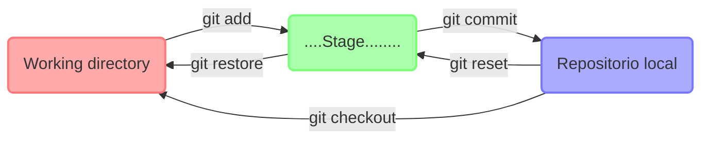
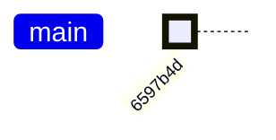
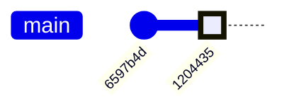
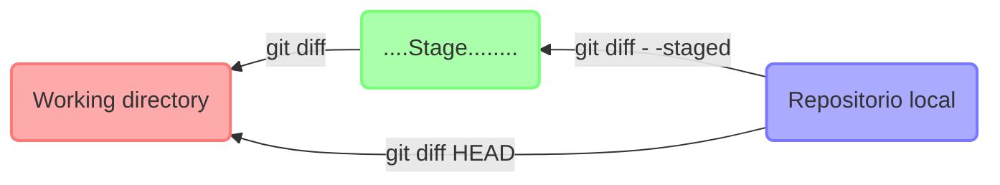
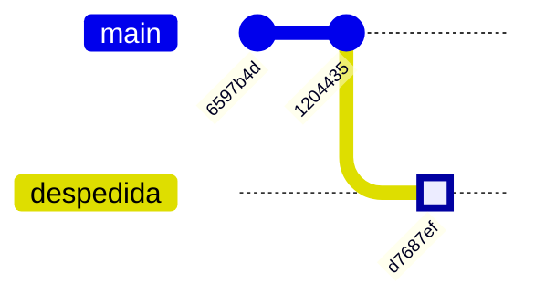
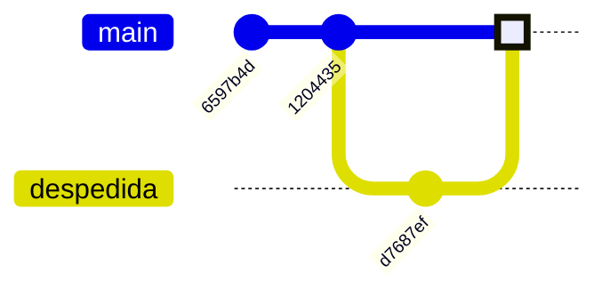

> Git es un sistema de control de cambios que permite llevar registro de modificaciones realizadas en los archivos de un repositorio, asi como facilitar la colaboración entre otras cosas.


# Git (local)

En esta primera parte vamos a ver como utilizar Git de forma local (sin acceder a servidores remotos como *github*, *gitlab* u otros).


## `git init`: Iniciar un repositorio:

Para comenzar a utilizar git es necesario ir a una carpeta donde se quiere producir el respositorio e iniciar git con:

```shell
$ git init
Initialized empty Git repository in /home/usuario/test_git/.git/
```
Git nos dice que se creo un repositorio (vacío). Este comando crea un subdirectorio `.git`, el cual conteine todos los archivos necesarios para el repositorio. 


## Estructura de ambiente de desarrollo:

Antes de seguír veamos como se estructura nuestro ambiente de desarrollo local.

- **Directorio de trabajo** ó *Working directory*: es el espacio donde trabajamos y modificamos nuestros archivos. En este espacio Git no trackea ni guarda modificaciones. Es decir si algo se modifica ó pierde dentro de este espacio no hay forma de recuperarlo.
- **Stage** (antiguamente conocido como *Index*). Es un espacio intermedio entre el *working directory* y el *History*, acá pondemos archivos temporalmente que luego van a actualizar el estado del repositorio.
- *History* ó **repositorio local**, este es el espacio más importante. Acá es donde se van a ir almacenando sucesivas "versiones" ó estados del repositorio que llamaremos *commits*. Cada vez que envíamos uno ó un grupo de archivos al *History* (decimos que hacemos un *commit*) actualizamos el estado del proyecto y se crea una nueva "fotografía" del repositorio. Esta fotografía representa el estado del repositorio de ese momento y que luego puede ser utilizada para comparar con las versiones anteriores y posteriores del repositorio (entre otras cosas).


Cualquier archivo dentro de nuestra carpeta de desarrollo puede estar en alguno de los siguientes estados:
- *untracked* (sin seguimiento)
- *tracked* (rastreados)
 + *unmodified* (no modificado)
 + *modified* (modificado)
 + *stagged* (preparado)
 + *commited* (confirmado)

Los archivos rastreados (*tracked*) son los que estaban en la última "fotografía" del proyecto: pueden ser archivos sin modificar, modificados ó preparados. Los archivos sin rastrear (*untracked*) son todos los demas.

Sé que al principio esto puede resultar bastante abstracto, pero a medida que usemos Git vamos a entender cual es la función de cada espacio. 



Lo primero a resolver es como mover archivos de un espacio a otro, para eso hay una serie de comandos:
- `git add <archivo>` **prepara** archivos (los manda al *stage*).
- `git commit` **confirma** archivos del *stage* (crea una nueva *fotografía* del proyecto).
- `git reset <archivo>` saca del *stage* un archivo, es decir lo copia del último commit y lo pone en el *stage*. 
- `git restore <archivo>` trae del *stage* un archivo, es decir descarta los cambios en el directorio de trabajo. 
- `git checkout <archivo>` copia el archivo desde la ultima fotografía al directorio de trabajo. 

A continuación vamos a construir un ejemplo para ver estos comandos en práctica.

## `git add`: preparar un archivo
En nuestro repositorio vacío, vamos a crear un archivo con algún contenido y luego lo llevaremos al *stage*:

```shell
$ echo "Hola mundi" > saludo.txt
$ git add saludo.txt
```


## `git commit`: confirmar un archivo

Para llevar el archivo al *history* usamos el comando `git commit`:

```git
$ git commit -m "agrego archivo saludo.txt"
[master (root-commit) 6597b4d] agrego archivo saludo.txt
 1 file changed, 1 insertion(+)
 create mode 100644 saludo.txt
```
generalmente `git commit` se ejecuta con la opción `-m` que sirve para dejar un mensaje o descripción del cambio que se realizó.

Este commit será el primer *nodo* (estado ó "fotografía") dentro del repositorio local:


Notar que a cada "commit" se le asigna un *hash* (ó id) que lo identifica, en este ejemplo es: "6597b4d".

Si corremos `git status` obtenemos:
```git
$ git status
On branch master
nothing to commit, working tree clean
```
nos dice que no hay nada para "commitear" (nada en el *stage*) y que el directorio de trabajo está limpio (nada en el *working directory*).


Vamos a generar ahora un nuevo commit, corrigiendo el error que habia en el archivo saludo.txt (decía "Hola mundi" en lugar de "Hola mundo"), y luego vamos a crear un nuevo commit con el archivo modificado:

```shell
$ echo "Hola mundo" > saludo.txt
$ git add saludo.txt
$ git commit -m "corrección ortográfica"
[master 1204435] corrección ortográfica
 1 file changed, 1 insertion(+), 1 deletion(-)
```

Ahora nuestro repositorio consiste en dos *commits* ó fotografías:



## `git status`: Ver estado de repositorio
Un comando muy útil es `git status`, este te permite conocer en que estado se encuentran los archivos en el ambiente de trabajo:

```shell
$ git status
On branch master

No commits yet

Changes to be committed:
  (use "git rm --cached <file>..." to unstage)
	new file:   saludo.txt
```
El comando nos está diciendo que estamos en la rama (ó *branch*) "master" (a veces se llama main), que no hay commits aún (es decir que el history está vacío) y que hay un archivo nuevo "saludo.txt" en el stage.


Si ejecutamos `git status -s` obtenemos una visión simplificada donde se listan los archivos con un codigo precedente que indica su estado, por ejemplo:

```shell
$ git status -s
M README
MM Rakefile
A lib/git.rb
M lib/simplegit.rb
?? LICENSE.txt
```

donde `??`: *untracked*, `A`: preparado, `M^: modificado. Notar que el estado tiene dos columnas, en la izquierda se indica el estado preparado y la de la derecha el estado sin preparar.


## `git diff`

Para ver exactamente cuales son los cambios entre archivos preparados ó no podemos usar `git diff`:


```shell
$ git diff archivo1
```

este comando te muestra exactamente cuales son los cambios, en que archivo y que linea sucedieron.

Existen varias opciones que nos permite comparar entre archivos en distintas etapas (preparados y no preparados):



También podemos comparar archivos entre dos commits:

```shell
$ git diff master master~1
```


> &#9888; Podemos usar `git difftool` para explorar las diferencias con otras herramientas como `vimdiff`.


## `git log`: Ver historia del repostorio

Para visualizar el estado del repositorio local usamos el comando `git log`:
```shell
$ git log --oneline
1204435 (HEAD -> master) corrección ortográfica
6597b4d agrego archivo saludo.txt
```
el comando nos muestra los dos commits que hicimos, con su correspondiente descripción. Además nos indica que el "cabezal" (**HEAD**) está posicionado en el commit `1204435`, en este caso en el último commit que hicimos. El HEAD representa nuestra posición en el repositorio.

Si queremos ver exactamente los cambios que se produjeron en cada commit usamos la opción `-p`.

> &#9888; `git log` se puede customizar bastante utilizando el flag `--pretty=<formato>`.


## Deshacer cosas

Dediquemos una sección a distintas formas que tenemos en `git` de deshacer error cometidos.


Un error comun es confirmar un cambio antes de tiempo y olvidar algun archivo sin agregar, o ponemos mal el mensaje de confirmacción, para eso podemos utilizar:

```shell
$ git commit --amend
```


Deshacer un archivo preparado: si pusiste por error un archivo en el *stage* podes sacarlode ahí con el comando: 
```shell
$ git reset <archivo>
```

> &#9888; `git reset` puede ser un comando peligroso especialmente si lo usamos con la opción `--hard` .


Deshacer un archivo modificado: si cambiaste un archivo pero antes de mandarlo al *stage* te das cuenta que no te gustaron las modificaciones que hiciste, entonces podes restaruarlo facilmente con:

```shell
$ git checkout -- <archivo>
```


## `git rm`: Eliminar archivos

Para eliminar archivos en git hay que eliminarlos de alrea de preparación y luego hacer un nuevo commit. Para esto existe el comando `git rm`, que elimina el archivo de tu directorio de trabajo de forma que no aparezca como archivo sin seguimiento en la proxima confirmación (cosa que no pasa si solo lo eliminas usando el comando de shell `rm`).
```shell
$ git rm archivo_indeseado.txt

```

Otra cosa que quizá quieras hacer es mantener el archivo en tu directorio de trabajo pero eliminarlo del *stage area*, para eso podemos ejecutar:
```shell
$ git rm --cached archivo_indeseado.txt
```


## `git checkout`: Navegar por el repositorio

Si queremos ir a ver una versión anterior podemos usar el commando `git checkout <hash>`:
```shell
$ git checkout 6597b4d
```

Para verificar nuestra posición podemos usar `git log` :
```shell
$ git log --oneline --all
1204435 (master) corrección ortográfica
6597b4d (HEAD) agrego archivo saludo.txt
$ cat saludo.txt 
Hola mundi
```
vemos que ahora el HEAD está en el commit anterior. Incluso el archivo que cambiamos volvio a su versión previa, es decir tenemos en el directorio de trabajo la versión de los archivos del commit en el que estamos. 

Para volver a la última versión del repositorio lo hacemos con `git checkout`:
```shell
$ git checkout 1204435
```
ó alternativamente usando el nombre de la rama a la que queremos ir (en nuestro caso master es el único branch):
```shell
$ git checkout master
```


---
# Ramificacón (*branching*) y fusión (*merging*)

En la mayoria de los desarrollos de software hay gente que trabaja de forma paralela en distintas partes ó funciones del código. Para hacer esto hacen uso de la creacción y fusión de "ramas" ó *branches*.


## `git checkout -b`: Crear branch

Ya vimos como crear nuevos commits, y como movernos en el repositorio, ahora exploremos una característica importante de `git` que es la posibilidad de generar ramificaciones (*branches*) en el repositorio:

Supongamos que queremos producir una rama paralela de este (inútil) proyecto que contenga un archivo de despedida.

Primero tenemos que generar una rama nueva, esto se puede realizar con el comando `git checkout -b <nueva_rama>`:

```shell
$ git checkout -b "despedida"
Switched to a new branch 'despedida'
```
vemos que git creo la rama `despedida` e inmediatamente puso el `HEAD` en esa rama.

> &#9888; Una comando equivalente a `git checkout -b <rama>` es `git branch <rama>`.

Hacemos las modificaciones:
```shell
$ echo "Chau mundo" > despedida.txt
$ git add 
$ git commit -m "agregar despedida.txt"
[despedida d7687ef] agregar despedida.txt
 1 file changed, 1 insertion(+), 1 deletion(-)
```

Con `git log --oneline --all` vamos a poder ver como queda nuestro repositorio.



## `git merge`: fusionar ramas.

Ahora supongamos que queremos incorporar nuestra modificación al branch principal, para esto tenemos que "unir" ó "fusionar" los dos branches usando el comando `git merge`.

Lo primero que hacemos es volver a nuestro branch principal y luego lo "mergeamos" con el branch nuevo (`despedida`):
```shell
$ git checkout master
$ git merge -b despedida
```

La estructura de nuestro repositorio ahora es:


> &#9888; Para resolver conflictos podemos usar alguna herramienta gráfica usando `git mergetool`.


### `git cherry pick`: traer algo de un commit de otra rama.

A veces queremos traer de otro branch no la totalidad de las modificaciones, sino tan solo un commit en particular. Para esto existe el comando `git cherry pick`

cherry-pick "copia" un commit, creando un nuevo commit en el branch donde estamos parados con el mismo mensaje que el otro commit.


### `git rebase`

Aveces ocurre que abrimos un branch, lo empezamos a trabajar y en paralelo el otros branches siguen avanzando de forma tal que el nuestro queda desactualizado. En cierto punto quizá querramos traer toda las modificaciones que se hicieron en el resto de las ramas, sin que esto implique hacer un `merge` ya que nuestro branch puede no estar finalizado. Para casos como este podemos usar `git rebase` 


Se puede pensar a `rebase` como una forma corta de hacer sucesivos `cherry pick`.


> &#9888; `git rebase` es un comando potencialmente peligroso cuando trabajamos en proyectos grandes con muchas ramas y actividad. Por lo cual se recomienda usarlo con mucha precaución, ó ante la duda elegir mejor usar `git merge`.


---
# Git (remoto)


Para colaborar en proyectos importantes es necesario aprender a gestionar repositorios remotos. Los repos remotos son versiones de un proyecte que están subidas a Internet ó cualquier otra red.


## `git clone`: Clonar repositorio remoto
```shell
$ git clone origin master
```

## `git remote`: Crear respositorio remoto
```shell
$ git remote
```


## `git push`: Llevar cambios a repositorio remoto

Cuando tenemos un proyecto que queremos compartirlo con el mundo entonces usamos: 

```shell
$ git push [nombre-remoto] [nombre-rama]
```

tipicamente usamos: `git push origin master`.


## `git fetch`: Traer objetos y referencias de repo remoto

Para obtener datos de proyectos remotos ejecutamos:
```shell
$ git fetch <repo_remoto> <rama>
```
este comando va al proyecto remoto y trae toos lso datos que no tenemos en nuestro ambiente local. Pero no modifica nuestro directorio de trabajo.


## `git pull`: Traer la version existente en repositorio remoto al repositorio local

Como ya vimos `git fetch` trae los cambios del servidor que no tenemos, pero sin modificar tu directorio de trabajo. Si queremos aplicar los cambios a nuestro entorno tenemos que aplicar `git merge`. El comando `git pull` simplemente resume estos dos procesos en uno solo:

```shell
$ git pull <repo_remoto> <rama>
```

es equivalente a hacer:
```shell
$ git fetch <repo_remoto> <rama>
$ git merge
```


---
# Miscelaneos:

## `git config`: Configurar Git

El commando `git config` permite obtener y establecer variables que controlan el aspecto y funcionamiento de Git. Estas variab les pueden almacenarse en tres sitios distintos:
1. `/etc/gitconfig` : Si usamos el flag `--system` aplica a todos los usuarios y repositorios del sistema.
2. `~/.gitconfig`: Si usamos el flag `--global` aplica a todos los repositorios de el usuario actual.
3. `.git/config`: cuando ejecutamos `git config` sin opciones, aplica solo al repositorio actual.

Para ver archivo de configuración, y editar sus variables:
+ `git config --global --edit`
+ `git config --local  --edit`
+ `git config --system --edit`

Algunos ejemplos:
+ Identidad (nombre): `git config --global user.name <name>`
+ Email: `git config --global user.email <email>`
+ Alias de usuario: `git config --global user.alias <alias-name> <git-command>`
+ Editor de texto preferido: `git config --system core.editor <editor>`

Para ver la configuración actual de git podemos usar:
```shell
$ git config --list
```

## `git help`: Obtener ayuda

Para ver que hace un comando de `git` podemos recurrir a cualquiera de los siguientes comandos:

```shell
$ git help <comando>
$ git <comando> --help
$ man git-<comando>
```


### `git stash`

Si tenemos archivos modificados en el directorio de trabajo y queremos ir a revisar un commit viejo, al intentar ir nos git va a tener un conflicto de versiones (ya que al hacer `checkout` git trae al directorio de trabajo la versión del commit al que vamos). En estos casos tenemos dos alternativas:
- hacemos un nuevo commit con los cambios actuales (aunque estén a medio hacer)
- ó podemos usar `git stash` para guardar estos archivos temporalmente en un espacio aparte, ir a revisar otras versiones, despues volver y recuperar nuestro trabajo del stash.

```shell
$ echo "cosa nueva.." >> saludo.txt
$ git stash
Saved working directory and index state WIP on master: d484fef agregar archivo despedida.txt
```

si hacemos `git status` vamos a ver que no hay nada en el working directory ni en el stage, por lo que es seguro ir a visitar viejos commits.

Si queremos ver las cosas que tenemos guardadas en el stash usamos: `git stash --list`.

Para traer las modificaciones desde el stash al directorio de trabajo usamos  `git stash pop <stash_id>`. En nuestro caso `git stash pop stash@{0}`.


### Ver historial de cambios comandos usados

Para revisar los comandos que fueron ejecutados existe el commando `git reflog`:
```shell
$ git reflog
1204435 (HEAD -> master) HEAD@{2}: checkout: moving from 6597b4d to master
6597b4d HEAD@{3}: checkout: moving from master to 6597b4d
1204435 (HEAD -> master) HEAD@{4}: commit: corrección ortográfica
6597b4d HEAD@{5}: commit (initial): agrego archivo saludo.txt
```


## `git tag`: Etiquetado

Git tiene la psibilidad de etiquetar puntos especificos del historial para marcar versiones importantes. 

Para ver tags en repositorio usamos:
```shell
$ git tag
```

Para crear una etiqueta ejecutamos:
```shell
$ git tag -a v1.0 -m "primer version del programa."
```


---
# Avanzado:

### Ignorar archivos intencionalmente: `.gitignore`
Aveces tenemos archivos que no queremos que tengan seguimiento por que son archivos temporales que se generan automaticamente cuando ejecutamos código ó algún programa. Para esto existe un archivo especial llamado `.gitignore`, donde podemos poner patrones de archivos a ignorar:

```shell
$ cat .gitignore
*.[oa]
*.mod
*~
*.swp
```
en este ejemplo git ignorará todos los archivos terminados en `.o` ó `.a` (tipicos objetos producidos cuando compilamos código), también ignorara los archivos terminados en `~` ó `.swp` que son archivos que remanentes creados en ciertas situaciones por editores de texto (emacs y vim respectivamente).


# El directorio `.git/`:
El directorio `.git/` se crea cuando ejecutamos `git init` y contiene toda la información y metadatos de nuestro repo.
A continuación veamos algunos archivos y carpetas que contiene y cuál es su proposito:

- `objects/`: guarda contenido del repositorio (blobs, trees, commits, y tags). Git usa *content-based addressing* par guardar los objetos los cuales se identifican por el hash SHA-1.
- `refs/`:contiene referencias a commits. Branches (refs/heads/), tags (refs/tags/), y referencias especiales como HEAD (refs/HEAD).
- `HEAD`: Es una referencia simbólica que aupunta a nuestra posición en el branch.
- `config`: This file contains configuration options for your repository.
- `index`: This is the staging area, also known as the index. It stores information about files that are staged for the next commit.
- `logs`:  This directory contains logs of changes made to the repository. For example, refs/heads/master would contain the log for the master branch.
- `hooks`: This directory contains client-side or server-side scripts that Git executes based on certain actions, such as pre-commit, post-commit, pre-push, etc.
- `info`:  This directory contains global exclude patterns for ignored files (exclude file) and auxiliary files for the Git repository.
- `config`:      This file holds repository-specific configuration options.
- `description`: This file is used by Git hosting services to provide a description of the repository.
- `modules`:     This directory is used if the repository is a submodule.
- `packed-refs`: This file contains references that have been packed (optimized for performance).


Ir a commits antiguos y modificar historial, combinar commits, etc.

```shell
$ git rebase -i HEAD~N
```

### UNDO errores:

`git restore` sirve para recuperar archivos borrados, o modificados y dejarlos como en el ultimo commit.

```shell
$ git restore <archivo>
```

se puede usar de formar interactiva por *patches* con `git restore -p`


Modificar ultimo commit:
```shell
$ git commit --amend -m "correccion"
```

Borrar commits luego de cierto nivel, voy con checkout al lugar que quiero y luego
```shell
$ git reset --herd
```


Recuperar commits borrados:

```shell
$ git reflog
```

Recuperar branches borrados:
```shell
$ git reflog
```


---

# Resumen Git 

- `git help <command>`: get help for a git command
- `git init`: creates a new git repo, with data stored in the `.git` directory
- `git status`: tells you what's going on
- `git add <filename>`: adds files to staging area
- `git commit`: creates a new commit
    - Write [good commit messages](https://tbaggery.com/2008/04/19/a-note-about-git-commit-messages.html)!
    - Even more reasons to write [good commit messages](https://chris.beams.io/posts/git-commit/)!
- `git log`: shows a flattened log of history
- `git log --all --graph --decorate`: visualizes history as a DAG
- `git diff <filename>`: show changes you made relative to the staging area
- `git diff <revision> <filename>`: shows differences in a file between snapshots
- `git checkout <revision>`: updates HEAD and current branch

## Branching and merging

- `git branch`: shows branches
- `git branch <name>`: creates a branch
- `git checkout -b <name>`: creates a branch and switches to it
    - same as `git branch <name>; git checkout <name>`
- `git merge <revision>`: merges into current branch
- `git mergetool`: use a fancy tool to help resolve merge conflicts
- `git rebase`: rebase set of patches onto a new base

## Remotes

- `git remote`: list remotes
- `git remote add <name> <url>`: add a remote
- `git push <remote> <local branch>:<remote branch>`: send objects to remote, and update remote reference
- `git branch --set-upstream-to=<remote>/<remote branch>`: set up correspondence between local and remote branch
- `git fetch`: retrieve objects/references from a remote
- `git pull`: same as `git fetch; git merge`
- `git clone`: download repository from remote

## Undo

- `git commit --amend`: edit a commit's contents/message
- `git reset HEAD <file>`: unstage a file
- `git checkout -- <file>`: discard changes


# Advanced Git

- `git config`: Git is [highly customizable](https://git-scm.com/docs/git-config)
- `git clone --depth=1`: shallow clone, without entire version history
- `git add -p`: interactive staging
- `git rebase -i`: interactive rebasing
- `git blame`: show who last edited which line
- `git stash`: temporarily remove modifications to working directory
- `git bisect`: binary search history (e.g. for regressions)


