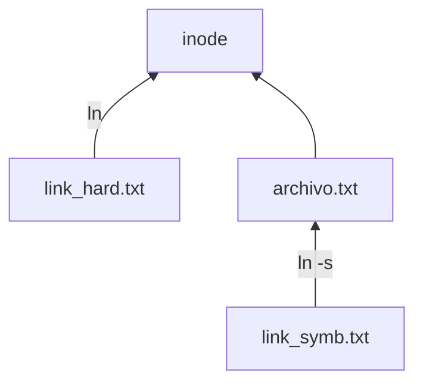

> La *shell* o terminal, es el programa que nos permite interactuar en tiempo real con el sistema operativo atraves de entradas que damos desde el teclado. Casi todos las distribuciones de Linux usan una sintaxis basada en un proyecto GNU llamado **bash** (*Bourne-Again SHell*) que es una versión sucesora del programa original `sh` para la linea de comandos. En sistemas Mac la sintaxis es casi identica, y Windows la esta empezando a adpotar.

## Prompt

Cuando usamos una interfaz gráfica de usuario (GUI), para interactuar con la *shell* necesitamos un programa intermedio conocido como *emulador de terminal*. Dependiendo el sistema operativo y distribución existen distintos emuladores de terminal. Normalmente hay algún icono de "terminal" ó "consola", pero tambien se puede acceder con alguna combinación de teclas como `ctrl`+`alt`+`T`. Como sea que se acceda, al abrirlo se despliega una ventana emergente (usualmente de fondo negro), con algo así:
```shell
usuario@pc:mi_dir$
```

Esto se conoce como **prompt**, antecede siempre al cursor, y nos da alguna informacion de cual es nuestro estado.
Lo primero que dice es quien es el usuario que va a ejecutar las instrucciones (*usuario*), luego del **`@`** dice desde que computadora (*pc*), seguido de **`:`** dice el directorio en el que estamos ubicados dentro de *pc*, y por ultimo un signo que indica los privilegios del usuario (**`$`**: usuario normal, **`#`**:superuser/admin).
El prompt es completamente customizable y por lo tanto es posible encontrar otras estructuras, pero en general por default tienen estos elementos.


## Comandos

La *shell* consiste basicamente en una seríe de comandos que están disponibles para el usuario. La mayoria de los comandos tienen la siguiente sintaxis:

```shell
comando -opcion <argumento>
```
donde `comando` es el comando que queremos ejecutar. `-opcion` son opciones de ejecución (tambien llamadas *flags*), y `argumento` son los argumentos del comando a ejecutar. Por ejemplo:

```shell
echo -n "Hola"
```

acá `echo` es un comando que imprime un mensaje en la pantalla. `-n` es una opción para que el mensaje no termine en linea nueva, y el argumento de este comando es el mensaje que se quiere mostrar.

> &#9888; Notar que un comando puede tener ninguno ó multiples *flags*, lo mismo aplica a los argumentos.

### Que es exactamente un comando?

Un comando puede ser alguna de las siguients cosas:
- Un **executable**: Un programa escrito en C/C++ o algún otro lenguaje como Pearl, Python, Ruby, etc.
- Un **comando interno de bash** (*shel built-in*), son funciones escritas en *bash* que vienen integrados por default en la shell.
- Una **función de bash**, son funciones de *bash* incorporadas por el usuario al *enviroment* (luego lo veremos en más detalle).
- Un **alias**, podemos crear *alias* de una función para que se llame como más cómodo nos resulte de recordar.

esta diferenciación no es tan importante, pero si quisieramos saber a que tipo pertenece un comando podemos utilizar el comando `type`:
```shell
usuario@pc:~$ type type
```

Muchas veces nos resulta útil saber cual es la ubicación de un comando, esto se puede conocer con el comando `which`:
```shell
usuario@pc:~$ which ls
```

### Ayuda

Existen en linux varios comandos que nos permiten obtener ayuda ó documentación acerca de un comando, uno de los más comunes es `help`:

```shell
usuario@pc:~$ help pwd
```

muchos ejecutables tienen soporte para la opción `--help` que nos muestra una descripción del mismo y como usarlo:

```shell
usuario@pc:~$ pwd --help
```

Muchos programas que son desarrollados para servir como comando en la shell suelen contener un archivo de documentación conocido como *manual* ó *man page*. Hay un comando que nos permite acceder a este y se llama `man`:
```shell
usuario@pc:~$ man pwd
```
un comando similar a `man` es `info`, suele .

Si buscamos una descripción breve de lo que hace el comando también podemos utilizar el comand `whatis`.

Por último, si queremos saber qué comando nos serviría para determinado proposito, para eso puede ser util el comando `apropos`:
```shell
usuario@pc:~$ apropos copy
```

### Historial de comandos

Con el comando `history` podemos ver y revisar los comando ejecutados recientemente.

Una forma alternativa de buscar un comando usado es con las teclas ``<ctrl>+r ``  y escribiendo el patrón de la linea que se desea buscar.


### Crear un alias para un comado

A veces deseamos tener un comando que ejecute alguna acción que realizamos frecuentemente, para esto podemos crear un `alias`, por ejemplo:
```shell
usuario@pc:~$ alias go_home='cd ~; echo "yendo a casa.."'
usuario@pc:~$ go_home
```


### Comentarios

Los comentarios son partes de código ó comandos que no se ejecutan. En el caso de la *shell* estos van precedidos del caracter **`#`**, por ejemplo:

```shell
# Esta linea es un comentario
```

Todo lo que sigue al simbolo **`#`** no hace absolutamente nada. No es algo demasiado útil en el contexto de la *shell* (pero sí en otros contextos), en este tutorial pueden aparecer así que vale la pena mencionarlo.


---
## Navegación

### Estructura de directorios en UNIX/Linux

Los sistemas basados en UNIX/Linux usan la filosofía de que *todo es un archivo* (ya veremos cuan cierto es esto), por lo que es muy útil tener una idea de como se organizan los archivos en el sistema. La estructura de carpetas en un sistema Linux tipico es así: 


| directorio       | descripción |
|------------------|-------------|
| `/`              | directorio *base* ó *root* del arbol de archivos.                             |
| `/bin`           | contiene *binarios* ó ejecutables indispensables para que el sistema funcione |
| `/boot`          | contiene archivos necesarios para el arranque del sistema (*boot*).           |
| `/home`          | contiene directorios base de los usuarios.                                    |
| `/home/<usuario>`| contiene todos los archivos del usuario "usuario".                            |
| `/lib`           | contiene librerias del sistema.                                               |
| `/usr`           | contiene ejecutables, librerias, y archivos copartidos.                       |
| `/usr/bin`       | Archivos binarios compartidos entre usuarios.                                 |
| `/usr/include`   | *headers* compartidos entre usuarios (usados por programas de C/C++).         |
| `/usr/lib`       | librerias compartidas entre usuarios.                                         |
| `/dev`           | contiene todos los dispositivos (*devices*) del sistema.                      |
| `/etc`           | contiene archivos de configuración del sistema.                               |
| `/tmp`           | almacena archivos *temporales*.                                               |
| `/root`          | es la carpeta base del administrador (ó *root*) del sistema.                  |
| `/media`         | puntos de acceso a dispositivos removibles (discos externos, pendrives, cd-roms, etc.) |
| `/mnt`           | puntos de acceso a dispositivos que necesitan ser montados manualmente            | 
| `/var`           | contiene archivos que son suceptibles a cambiar (variables), bases de datos, etc. | 
| `/proc`          | contiene archivos que representan los *procesos* activos del sistema.             | 
| `/opt`           | directorio que contiene software *opcional* instalado.                            | 


### Moverse en el sistema de archivos y ver contenido

Veamos como navegar en LINUX, esto es ir de una carpeta a otra y revisar el contenido, etc.

Para conocer la ubicacion absoluta en la que estamos (la del prompt es relativa a la carpeta principal del usuario) utilizamos el comando `pwd`:
```shell
usuario@pc:~$ pwd
/home/usuario
```

Si queremos ver el contenido de la carpeta donde estamos posicionados escribimos:
```shell
usuario@pc:~$ ls	
Desktop  Documents Downloads Music  Pictures  Public  Templates Videos
```

Para "ir a" ó "cambiar" de directorio usamos `cd`:
```shell
usuario@pc:~$ cd Desktop   
usuario@pc:~/Desktop$ cd ..
usuario@pc:~$
```
> &#9888; Notar que con `cd ..` retornamos al directorio *madre*. 
> &#9888; Otro *short-cut* útil es: `cd -` que retorna al directorio de trabajo anterior.

Para *limpiar* la pantalla de comandos escribimos:
```shell
usuario@pc:~$ clear
```
> &#9888; una alternativa de `clear` para limpiar es `<CTRL>`+`l`


---
## Manipular directorios y archivos

Veamos como crear/borrar directorios y archivos:

Para crear/borrar una carpeta (ó directorio) existen los siguientes comandos:
```shell
usuario@pc:~$ mkdir carpeta	#crea directorio
usuario@pc:~$ rmdir carpeta	#elimina directorio
usuario@pc:~$ rm -r carpeta	#elimina directorio y todo su contenido (OJO!)
```

Para crear/borrar un archivo:
```shell
usuario@pc:~$ touch archivo.txt	#crea archivo vacio/actualiza fecha de acceso
usuario@pc:~$ rm archivo.txt	#borrar archivo
```

Otras acciones que podemos hacer con directorios y archivos son "copiar", "cortar" (mover) y "pegar":
```shell
usuario@pc:~$ cp archivo.txt archivo_copiado  #copiar archivo 
usuario@pc:~$ mv archivo.txt archivo_movido   #mover archivo (tambien sirve para renombrar)
```

### Links simbolicos y duros

Algo análogo a los "accesos directos" de Windows son los links, y en Linux los hay de dos tipos: simbólicos (*symlink*) y duros (*hard-links*)

Un link simbólicos se crea así:
```shell
usuario@pc:~$ ln -s archivo.txt link_soft
```

Un link duro se crea así:
```shell
usuario@pc:~$ ln archivo.txt link_hard 
```

estos ultimos son más antiguos que los simbólicos y tienen algunas limitaciones por lo que se recomienda usar links simbólicos.

### Inodes
Para entender la diferencia entre links simbólicos y duros podemos imaginar que los archivos consisten en dos partes: 
- su contenido, 
- y su nombre/metadata.

cuando creamos *hard-links* estamos creando un nombre adicional para un bloque de contenido pre-existente. Tanto el archivo original como el link son indistinguibles ya que son dos formas distintas de nombrar al mismo conjunto de datos. Si borramos el archivo original el link sigue funcionando ya que el contenido no se borra y el link sigue apuntando al bloque datos original.

Cuando creamos un *sym-link* lo que creamos es un nuevo archivo que apunta al nombre del archivo original. En este sentido si borramos el archivo original este link queda "huerfano" y no posee ningun dato.
 
Cada archivo tiene un idenitificador único conocido como *inode-number* podemos ver el inode de cada archivo con el siguiente comando:

```shell 
usuario@pc:~$ ls -li
total 0
23644375 -rw-r--r-- 2 usuario usuario 0 feb 27 11:10 archivo.txt
23644375 -rw-r--r-- 2 usuario usuario 0 feb 27 11:10 link_hard
23644387 lrwxrwxrwx 1 usuario usuario 7 feb 27 11:10 link_soft -> archivo.txt
``` 

notar que los links duros y tienen el mismo *inode-number* que su archivo target, pero los links simbólicos no.




### Informacion de archivos

Como ya dijimos Linux sigue la idea de que *todo es un archivo*, pero aún así hay muchos tipos de archivos y formatos, algunos nos resultan familiares como MP3, JPEG, pero otros pueden ser más extraños. Hay un comando que nos permite ver a que tipo pertenece un archivo:
```shell
usuario@pc:~$ file <archivo>
```

también existen comandos que nos dan información sobre un archivo:
```shell
usuario@pc:~$ stat <archivo>
```

---
## Input/Output

Muchos de los comandos utilizados hasta ahora generan un output de algun tipo. Estos outputs consisten en dos tipos:
- resultados que el programa esta diseñado a producir (*stdout*)
- estado y mensajes de error  (*stderr*)

Por ejemplo, `ls` manda sus resultados a un archivo especial `/dev/stdout`, y los mensajes de error a otro llamado `/dev/stderr`. Ambos estan linkeados por default con la pantalla.

Ademas muchos programas toman sus argumentos de un *stdin*, por default linkeado a las entradas desde el teclado.


### Redireccion de `stdout`, `stderr` y `stdin`

Las salidas de los comandos por default van a la pantalla, y los inputs se toman desde el teclado.
Sin embargo podemos decidir donde llevar los stdin/stdout utilizando comandos de *redireccionamiento*:

```shell
usuario@pc:~$ ls /usr/bin > ls-output.txt
```
acá enviamos la lista de los archivos almacenados en `/usr/bin` a un archivo llamado `ls-output.txt`. Podemos ver su contenido usando el comando `cat`:
```shell
usuario@pc:~$ cat ls-output.txt
```

cada vez que redirecionamos utilizando el simbolo `>` el archivo se borra completamente y sobreescribe el mensaje de salida. Pero es posible tambien redireccionar de forma que se agregue como una nueva linea a un archivo preexistente:

```shell
usuario@pc:~$ echo "hola"        >  archivo.txt    
usuario@pc:~$ echo "como estás?" >> archivo.txt    #archivo a archivo (lo agrega)
usuario@pc:~$ cat archivo.txt
hola
como estás?
```

Hagamos de nuevo una redirección pero esta vez vamos a ejecutar `ls` sobre un directorio que no existe para forzar un mensaje de error:
```shell
usuario@pc:~$ ls /bin/usr > ls-output.txt
ls: cannot access /bin/usr: No such file or directory
```
vemos un mensaje de error, pero ¿Por que se muestra en pantalla y no fue redireccionado al archivo ls-output.txt? Esto se debe a que los mensajes de error no se envian como *stout*, sino por la vía de *stderr*. Si queremos redireccionar un mensaje de error usamos `2>`:

```shell
usuario@pc:~$ ls /bin/usr 2> ls-error.txt
```

> &#9888; Es común ver que los mensajes de error se redireccionan a un archivo especial `/dev/null`, a este archivo (también conocido como *bit bucket*) se envian frecuentemente cualquier mensaje o datos que no nos interesan ni serán usados en el futuro.

También es posible redireccionar las entradas que damos por teclado (*stdin*):
```shell
usuario@pc:~$ cat archivo.txt
```

`cat` lee uno o más archivos y los copia dentro de *stdout*. Se usa generalmente para leer archivos cortos, y para concatenar archivos.

Si ejecutamos `cat` sin ningun argumento este redirecciona todo lo que tipeamos en el tecldo (*stdin*) al *stdout*:
```shell
usuario@pc:~$ cat 
hola
hola
como estás?
como estás?
```

Como siempre podemos redireccionar esto a un archivo usando el simbolo `>`:
```shell
usuario@pc:~$ cat > archivo.txt
hola
como estás?
usuario@pc:~$ cat archivo.txt
hola
como estás?
```
> &#9888; `cat` es frecuentemente usado para concatenar multipls archivos `cat archivo_1.txt archivo_2.txt > archivo_1y2.txt`

#### Pipelines

Una forma comun de redirigir `stdout` de un comando para usarlo como `stdin` de otro comando es mediante el uso de *pipelines* (`|`):

```shell
usuario@pc:~$ ls /usr/bin | sort	 
```
en este ejemplo listamos los archivos presentes en `/usr/bin` y la salida se la pasamos al comando `sort` que ordena la lista de forma alfrabetica. `sort` en este ejemplo juega el rol *filtro*, ya que toma una salida como *stdout*, la procesa y devuelve una nueva salida. Existen otros filtros, por nombrar algunos de los más usados: `uniq`, `grep`, `wc`, entre otros.


Existe un comando frecuentemente usado que toma un *stdout* y lo redirecciona a un archivo y al mismo tiempo a *stdout*, este se llama `tee` :

```shell
usuario@pc:~$ echo "Hola" | tee archivo.txt
Hola
usuario@pc:~$ cat archivo.txt
Hola
```

Hay ciertos comandos que no admiten *stdout* como argumentos, por ejemplo:
```shell
usuario@pc:~$ echo "carpeta" | mkdir
mkdir: missing operand
```

para esto existe el comando `xargs` que toma valores de *stdout* y los convierte a una lista de argumentos para determinados comandos:
```shell
usuario@pc:~$ echo "carpeta" | xargs mkdir	
```


### Status

Luego de ejecutar un comando ó programa podemos revisar el estado del sistema para ver si se ejcuto correctamente:
```shell
usuario@pc:~$ ls /bin/usr
usuario@pc:~$ echo $?
```

---
## Trabajar con archivos de texto

Veamos como podemos manipular archivos que contienen información como texto. Para ver el contenido de un archivo tenemos varias opciones, para archivos cortos la opción más usada es `cat`:

```shell
usuario@pc:~$ cat archivo.txt	
```

cuando el archivo es muy extenso y sólo queremos ver una parte de este podemos usar `head` ó `tail`, estos muestras las primeras y últimas lineas respectivamente:

```shell
usuario@pc:~$ head archivo.txt
usuario@pc:~$ tail archivo.txt
```

Para ver el contenido de un archivo de forma interactiva existe el comando `less` (ó su versión precesor `more`):
```shell
usuario@pc:~$ less archivo.txt 
```
al ejecutarlo se entra a un modo de visualización donde podemos explorar el archivo de forma interactiva, scroleando hacia abaho usando las flechitas, para salir apretamos la tecla `q` de *quit*.

Un comando muy útil para comparar archivos, es `diff`:
```shell
usuario@pc:~$ diff archivo1 archivo2
```

### Editores de texto
Si buscamos una herramienta para leer y editar un archivo de texto que contenga más funciones, tenemos varias alternativas:

- `gedit`: es lo más parecido a un bloc de notas de Windows, es fácil de utilizar pero no tiene demasiadas funcionalidades.
- `vim`, `nano`, `emacs`, etc. : estos son editores con muchas más capacidades.


### Editores *al vuelo*: `sed`
Un editor *on the fly* muy utilizado es `sed` (*Stream EDitor*), este permite realizar cambios u obtener porciones bien especificas del archivo con una escritura muy compacta y performance alta:

```shell
usuario@pc:~$ sed 's/[eiou]/a/g' archivo.txt > archivo_nuevo.txt
```

en este ejemplo reemplazamos todas las vocales presentes en `archivo.txt` por la vocal `a`, y redirigimos el *stdout* al archivo `archivo_nuevo.txt`. 

> &#9888; Otro editor al vuelo muy poderoso y utilizado es `awk`.

### Expresiones regulares: `grep`

Las expresiones regulares son formulas abstractas que representan un conjunto de secuencias de texto que satisfacen un patrón. Por ejemplo, la expresión regular `+54 11 ####-####` representa al conjunto de los numeros de telefono de CABA Argentina, siendo `#` un numero entero entre 0 y 9. 

Las expresiones regulares se utilizan mucho en el procesamiento de tetos, para realizar busquedas, extraer información, reemplazar patrones, validar datos, entre otras cosas.

La shell contiene distintos comandos para trabajar con expresiones regulares, el más popular es ``grep``, por ejemplo:

```shell
usuario@pc:~$ ls | grep ".txt"	
```

en este ejemplo, `grep` filtró de los archivos listados en `ls`, aquellos cuyo nombre termine en `.txt`. El simbolo `.` en este caso representa "cualquier caracter alfanumérico". Grep hace uso de estos *caracteres especiales* (llamados *wildcards*) para representar patrones, otros caracteres especiales que podemos encontrar son:

|simbolo| significado (en `grep -E`)                             |
|-------|---------------------------------------------------     |
| `*`   | 0 ó más ocurrencias del caracter precedente.           | 
| `+`   | 1 ó más ocurrencial del caracter precedente.           | 
| `?`   | 0 ó 1 ocurrencia del caracter precedente.              | 
| `[]`  | 1 ocurrencia del conjunto de caracteres dentro de [].  | 
| `[^]` | complemento de [].                                     | 
| `|`   | operador "OR" (unión)                                  | 

> &#9888; OJO! en otros comandos y contextos el significado de `*`, `.` y el resto de los simbolos puede cambiar.

---
## Busqueda de archivos: `find`

Existe un comando muy eficiente para encontrar archivos y directorios llamado `find`, cuya sintaxis básica es:

```shell
usuario@pc:~$ find <path> 
```

donde `<path>` es la carpeta donde se busca el archivo. Por ejemplo:
```shell
usuario@pc:~$ find ~/Desktop 
```

en este caso `find` va a listar la totalidad de los archivos incluidos en el `~/Desktop` (muchos). 

Para hacer una busqueda más especifica podemos incorporar distintos filtros como `-name`, `-type`, `-size`, por ejemplo si queremos encontrar todos los archivos de tamaño mayor a 2 GB:
```shell
usuario@pc:~$ find /home/ -size +2G 
```

para acotar la busqueda podemos agregar cuantos niveles de directorios con los flags `-maxdepth`.

```shell
usuario@pc:~$ find <patron> -type d/f/l -size b/c/w/k/M/G -name "pattern"
usuario@pc:~$ find <patron> \(-type d \) -and/-or/-not  \(-size M  \)
usuario@pc:~$ find <patron> -type d/f/l -size b/c/w/k/M/G -name "pattern"
usuario@pc:~$ find <patron> -delete/-ls/-print/-quit
usuario@pc:~$ find <patron> -delete/-ls/-print/-quit -exec ls -l '{}' ';'
```

--- 
## Permisos y usuarios

Linux es un sistema operativo *multiusuario*, esto significa que muchos usuarios pueden estar utilizando la misma computadora en simultaneo. Cada usuario tiene un id, pertenece a almenos un grupo y tiene ciertos privilegios.

```shell
usuario@pc:~$ id    
usuario@pc:~$ users 
usuario@pc:~$ groups
```
Para ver cual es nuestra identidad podemos usar `whoami`:
```shell
usuario@pc:~$ whoami
usuario
```

### Acceso: lectura, escritura y ejecución

El acceso a archivos o directorios se definen en terminos de acceso a la lectura, escritura y ejecución. 
Para ver como esto funciona analicemos la salida del comando `ls -l`:
```shell
usuario@pc:~$ ls -l
drwxr-xr-x  8 usuario usuario    69632 may 19 22:55  Desktop
-rw-r--r--  1 usuario usuario     8980 abr  9 12:03  examples.desktop
lrwxrwxrwx  1 usuario usuario       15 may 27 14:43  dni.pdf -> Desktop/dni.pdf
```

Prestemos atención a los primeros 10 caracteres de cada linea. La primer letra describe el tipo de archivo (**d**: directorio, **l**: link, **-** otro.) lo últimos 9 caracteres nos dicen el modo ó permisos de uso del arcihvo ó directorio (donde: **r**: permiso de lectura, **w**: permiso de escritura, **x**: permiso de ejecucion.

El modo queda definido por tres numeros binarios (ó su equivalente decimal). Por ejemplo `Desktop` tiene modo d 111 101 101 (es decir: 755) y `examples.desktop` tiene modo - 110 100 100 (es decir 644). La forma de leerlo es:

| descr.   | {tipo} |  {user}  | {group} | {anyone} | 
|:-------- |:------:|:--------:|:-------:|:--------:| 
| alphanum |   d    | r w x    | - w -   |  r - x   | 
| binario  |        | 1 1 1    | 0 1 0   |  1 0 1   | 
| decimal  |        |   7      |   2     |     5    | 

Para modificar el *modo* se utiliza el comando `chmod`, por ejemplo para agregar permiso de ejecución:

```shell
usuario@pc:~$ chmod +x script.sh
```

Para cambiar de propetiario y grupo de un archivo se utilizan los siguientes comandos:
```shell
usuario@pc:~$ chown archivo.txt	#change owner (propietario)
usuario@pc:~$ chgrp archivo.txt	#change group 
```

### Cambio de idenidades

A veces ocurre que queremos leer, escribir ó ejecutar un archivo pero no tenemos los permisos correspondientes, por ejemplo:

```shell
usuario@pc:~$ ./enviar_cohete_a_marte.sh
bash: ./enviar_cohete_a_marte.sh: permision denied
```

con el comando `su` podemos cambiar de identidad para ejcutarlo como su propietario:
```shell
usuario@pc:~$ su elon 
elon@pc:~$ ./enviar_cohete_a_marte.sh
Enviando cohete...
elon@pc:~$ 
```

por razones de seguridad en la actualidad es más común el uso de `sudo`, sobre todo para poder ejecutar comandos en calidad de administrador ó *super-user*:

```shell
usuario@pc:~$ sudo --user=elon ./enviar_cohete_a_marte.sh
```
esto es muy útil cuando se quieren instalar programas ó hacer cambios importantes en la configuración de la computadora.

> &#9888; Si no especificamos el `--user` asume que queremos ser *root*.
> &#9888; `sudo` solo permite ejecutar un comando a la vez.


--- 
## Procesos

Los sistemas operativos basados en linux son *multi-task*, esto quiere decir que la secuencia de ejecucion de programas la realizan de tal forma que pareciera que se estan realizando multiples tareas en simultaneo (esto es estrictamente asi cuando la computadora posee varias unidades de procesamiento, que hoy en dia es lo más común):

### Como funciona un proceso?
Cuando el sistema se inicia, el kernel inicia sus actividades como procesos y lanza un programa llamado `init`. `init` a su vez ejecuta una serie de scripts (ubicados en `/etc`) llamados *init scripts*, que comienzan los servicios del sistema. Muchos de estos servicios se implementan como *daemons*, estos son programas que estan en las sombras haciendo sus cosas sin interferir con el usuario. Por lo que aunque ni estemos logeados el sistema está ocupado haciendo sus cosas rutinarias.
El hecho de que el programa lance subprogramas se denomina *proceso madre*, produce *procesos hijos*.
El kernel mantiene información sobre cada proceso para mantener todo organizado. Por ejemplo, a cada proceso se le asigna un numero llamado *process ID* (`PID`). Los PIDs son asignados en orden ascendente donde `init` siempre tiene el valor de 1. El kernel tambien mantiene control de la memoria asignada a cada proceso, asi como su estado para continuar la ejecución. Como los archivos, los procesos también tienen *owners*, *user ID*, y demás.

### Ver procesos

El comando más usado para ver un *snapshot* de los procesos en ejecución es `ps`:
```shell
usuario@pc:~$ ps
    PID TTY          TIME CMD
 317940 pts/2    00:00:00 bash
 383698 pts/2    00:00:00 ps
```
podemos ver que hay dos procesos `bash` y el proceso `ps`, muestra los PID de cada proceso, el `TTY` (*teletype*) que es la terminal desde donde se controla el proceso, el `TIME` es el tiempo de CPU consumido por cada proceso.

Si agregamos el flag `xau` podemos ver los procesos controlados por todos los TTY: 
```shell
usuario@pc:~$ ps xau
USER         PID %CPU %MEM    VSZ   RSS TTY      STAT START   TIME COMMAND
root           1  0.0  0.0 166792 10852 ?        Ss   10:42   0:02 /sbin/init splash
root           2  0.0  0.0      0     0 ?        S    10:42   0:00 [kthreadd]
root           3  0.0  0.0      0     0 ?        I<   10:42   0:00 [rcu_gp]
root           4  0.0  0.0      0     0 ?        I<   10:42   0:00 [rcu_par_gp]
root           5  0.0  0.0      0     0 ?        I<   10:42   0:00 [slub_flushwq]
root           6  0.0  0.0      0     0 ?        I<   10:42   0:00 [netns]
...
```

Además de que vemos los procesos de otros TTY (gracias al flag `x`), también vemos que hay más información (gracias a los flags `a` y `u`), tenemos información del `USER` que ejecuta el proceso, el `PID`, el porcentaje de CPU y Memoria que consume, el `RSS` (*Resident Set Size*) es una medida de la memoria RAM utilizada, también podemos ver el estado del proceso `STAT` (donde `R`: running, `S`: sleeping, `T`: Stopped, `Z`: zombie, `N`: low-priority process, etc.), el `TIME` en que fue lanzado y por último el nombre del comando lanzado.

Existen otros comandos para seguir procesos, uno muy utilizado es `top` que permite seguir procesos en tiempo real:
```shell
usuario@pc:~$ top
```

### Control de procesos

Ahora que podemos monitorear los procesos intentemos realizar cosas con ellos.

Vamos a lanzar un proceso que simplemente muestra un logo en una ventana emergente llamado `xlogo`:

```shell
usuario@pc:~$ xlogo &
[1] 420000
usuario@pc:~$ jobs
[1]+  Running                 xlogo &
```

al usar `&` mandamos directamente el proceso al fondo inmediatamente luego de ejecutarlo. Para traerlo al frente usamos:

```shell
usuario@pc:~$ fg %1
```

vamos a ver que la terminal ya no está disponible, para parar el proceso podemos usar `ctrl` + `Z`, veremos que ahora el proceso está parado:

```shell
[1]   Interrupt               xlogo
usuario@pc:~$ jobs
[2]+  Stopped                 xlogo
```

para volver a inicial el proceso pero en el fondo podemos usar:
```shell
usuario@pc:~$ bg %2
```

Si queremos terminar el proceso podemos traerlo al frente denuevo con `fg %1` y luego matarlo con `ctrl`+`C`.


### Envio de señales: `kill`

Hay una forma más prolija de manejar procesos y esto es mediante el envio de señales con el comando `kill`.

Para terminar un proceso podemos usar `kill`:
```shell
usuario@pc:~$ kill <PID>   
```

además de matar un proceso con `kill` podemos enviar otras señales:

```shell
kill -s [señal] PID
```

Señales comúnes:

| Num.| Señal   | Significado                                        |
|:----|:--------|:---------------------------------------------------|
| 1   | `HUP`   | Hang up.                                           |
| 2   | `INT`   | Interrupt. (`ctrl`-`C`)                            |
| 3   | `QUIT`  | Quit.                                              |
| 9   | `KILL`  | Kill.                                              |
| 15  | `TERM`  | Terminate. (default).                              |
| 18  | `CONT`  | Continue. Restaura proceso luego de una señal STOP.|
| 19  | `STOP`  | Stop. Pausa sin terminar el proceso.               |
| 11  | `SEGV`  | Segmentation violation.                            |
| 20  | `TSTP`  | Terminal stop. (`ctrl`-`Z`)                        |
| 28  | `WINCH` | Window change.                                     |


> &#9888; Notar que cuando usamos `ctrl`-`C` y `ctrl`-`Z` en realidad lo que estabamos haciendo es enviar las señales de `INT`y `TSTP` respectivamente.


Aveces queremos eliminar multiples procesos a la vez, esto es posible mediante el uso del comando `killall <nombre_del_programa>`

---
## Información del sistema

Vamos a hacer un recorrido sobre algunos comandos que nos permiten extraer información del sistema.

El primero es `uname` que nos da información genérica sobre el sistema operativo:
```shell
usuario@pc:~$ uname -a
Linux usuario 6.5.0-21-generic #21~22.04.1-Ubuntu SMP PREEMPT_DYNAMIC Fri Feb  9 13:32:52 UTC 2 x86_64 x86_64 x86_64 GNU/Linux
```

Existen comandos que nos dan idea de la memoria libre y el espacio en el disco rigido:
```shell
usuario@pc:~$ free	      #memoria libre
usuario@pc:~$ df	      #espacio libre en el disco rigido
```

Para ver cuanta memoria está usando un archivo o directorio existe el comando `du`:
```shell
usuario@pc:~$ du --block-size=M Desktop/
```

Un comando muy importante para trabajar con fechas es `date`:
```shell
usuario@pc:~$ date 
```


### Environment

Durante su ejecución, la *shell* mantiene cierta información sobre la sesión llamado *entorno* ó *environment*. Muchos programas pueden acceder a estos datos para ajustar su comportamiento. 

Para ver que información esta almacenado en el entorno usamos el comando `env`
```shell
usuario@pc:~$ env | less
```

Si queremos conocer el valor de determinadas variables podemos usar `printenv`:
```shell
usuario@pc:~$ printenv HOME
/home/usuario
```

Otra forma de acceder es usando la notación `$` para ver el valor de las variables con `echo`:
```shell
usuario@pc:~$ echo $HOME
/home/usuario
```

Cuando nos logeamos al sistema `bash` corre y lee una serie de scripts conocidos *startup files* que definen los valores por defecto del entorno. 
Los más comunes son los siguientes:

| File              | Contenido                                                |
| */etc/profile*    | Script global de configuración que aplica a todo usuario |
| *~/.bash_profile* | Script personal del usuario.                             |
| *~/.bash_login*   | Se ejecuta en caso que *~/.bash_profile* no se encuentre.|
| *~/.profile*      | Si los anteriores no se encuentran se ejecuta este.      |

Hay otros *startup files* que se ejecutan cada vez que se abre una sesión en la terminal:

| File              | Contenido                                                |
| */etc/bash.bashrc*| Script global, aplica a todos los usuarios.              |
| *~/.bashrc*       | Script personal.                                         |


---
## Compresión de archivos

La compresión de datos es el proceso de remover *redundancia* de lso datos.
Los algoritmos de compresión caen en dos grandes categorías:
- *Lossless*, preservan la totalidad de los datos originales.
- *Lossy*, hay perdida de información.

Acá vamos a focalizarnos en herramientas que usan el primer tipo de compresión.

Para comprimir uno o varios archivos usamos los comandos: `gzip` y `gunzip`. Cuando `gzip` es ejecutado reemplaza el archivo original por una version comprimida del mismo. `gunzip` restaura el archivo comprimido por el original.

```shell
usuario@pc:~$ ls -l archivo.txt 
-rw-rw-r-- 1 usuario usuario 15612 mar  5 23:34 archivo.txt
usuario@pc:~$ gzip archivo.txt 
usuario@pc:~$ ls -l archivo.txt.gz 
-rw-rw-r-- 1 usuario usuario 6589 mar  5 23:34 archivo.txt.gz
usuario@pc:~$ gunzip archivo.txt 
```

> &#9888; existen los comandos `bzip2` y `bunzip2` que cumplen la misma función y tienen una sintaxis similar. Simplemente usan un algoritmo de compresion distinto.


Para archivar documentos podemos utilizar el programa `tar`, cuyas opciones principales son ``-c`` para agrupar archivos y ``-x`` para desagrupar. 
```shell 
usuario@pc:~$ tar -cvf comprimido.tar.gz carpeta 
usuario@pc:~$ tar -xzvf comprimido.tar.gz
```

`zip` y `unzip` estos comandos cumplen la doble función de archivar y comprimir.

---
## Manejo de paquetes y librerias

Uno de los aspectos más importantes en la elección de una distribución de Linux es la calidad del sistema de manejo de paquetes y vitalidad de soporte de su comunidad.

En linux todo el software está disponible en internet, y la mayoria de este viene en forma de *paquetes* que provee el desarrollador, en algunos casos solo está disponible el codigo fuente y es necesario compilarlo e instalarlo manualmente.

Los *paquetes* mencionados consisten en una colección de archivos y programas para instalar el software. Además contiene metadatos con la descripción del software, su contenido y dependencias. Estos *paquetes* son creados por lo que se conoce como *package mantainer*, este recibe el codigo fuente lo compila y crea este paquete junto con todos los scripts para adaptarlo al sistema en donde será instalado.

Si bien algunos desarrolladores prefieren crear sus propios paquetes y hacer la distribución de los mismos, lo más común es que los paquetes estén centralizados en *repositorios* mantenidos los que manejan cada distribución del sistema operativo.

Si bien los paquetes contienen un solo programa, muchas veces estos necesitan de la presencia de otros para funcionar, esto se conoce como *dependencia*, y los gestores de paquetes suelen tener algún método para detectarlas e instalarlas también.

En los sistemas Linux, hay dos grandes grupos sistemas de gestión de paquetes:

| Sistema  | Distros que lo usan                     |
| `.deb`   | Debian, Ubuntu, Mint, Raspbian, etc.    |
| `.rpm`   | Red-Hat, CentOS, Fedora, OpenSUSE, etc. |

acá vamos a poner el foco en los sistemas de gestion de paquetes tipo *debian* (`.deb`), pero los otros son muy parecidos.

Para la gestión de paquetes hay herramientas de alto y bajo nivel de abstracción, para los primeros existe el comando `apt` (ó `apt-get` en viejas versiones), y para los de bajo nivel tenemos `dpkg`.

### `apt`
Esta herramienta permite instalar, desinstalar paquetes:
```shell
usuario@pc:$ apt install <programa>
usuario@pc:$ apt remove  <programa>
```

> &#9888; para ejecutar `apt` normalmente se requieren privilegios de administrador, por lo que se ejecuta antecedido por el comando `sudo`.

También `apt` se utiliza para detectar actualizaciones e instalarlas:
```shell
usuario@pc:$ apt update		   
usuario@pc:$ apt upgrade	   
```

### `dpkg`
```shell
usuario@pc:$ dpkg -l       
usuario@pc:$ dpkg -s      <programa>  
usuario@pc:$ dpkg install <programa>
usuario@pc:$ dpkg remove  <programa>
usuario@pc:$ dpkg purge   <programa>
```


---
## Networking

Una red es un conjunto de computadoras que se comunican entre ellas intercambiando datos.
Esta compuesto por dispositivos (computadoras, impresoras, etc.), un *switch* que conecta todo junto, un *router* (ó gateway), firewall, etc.

### Conceptos previos: 
- Internet Protocol (IP) address. Identificador de dispositivo en una red.
- Puerto: conexion logica usada por programas y servicios para intercambiar información. Puede tomar valores entre 0-65535.
- Uniform Resource Identifier (URI): identifica la ubicación (URL) y nombre (URN) de un recurso en la internet.
- Domain Name Service (DNS): Asocia IPs con URLs.
- Tipos de redes:
  + LAN (*Local Area Network*)
  + WLAN (*Wireless LAN*)
  + WAN (*Wide Area Network*)
  + VPN (*Virtual Private Network*)

Para acceder a algún contenido de internet necesitamos una `URL` para establecer la comunicación que nos indique dónde y cómo podemos ubicarla, las URL siguen la siguiente estructura:
```
{protocolo}://{domainio}:{puerto}/{path}?{query-string}#{fragment}
http://ejemplo.com:80/index.html?nombre=Juan&apellido=Garcia#Introduccion
```
donde:
- {protocolo}   : http/https/ftp
- {dominio}     : IP ó nombre de website
- {path}        : ruta al html o archivo
- {puerto}      : 80(http), 443(https) y 21(ftp), 25 (email,smtp)
- {query-string}: variables y valores: "?var1=2&var2=3&...&varN=N".
- {fragmento}   : seccion de la pagina

<!--
El sistema abierto de interconección (**OSI**) describe 7 capas que las computadoras usan para comunicarse en una red.
+ Layer 1: Physical
+ Layer 2: Data-link
+ Layer 3: Network
+ Layer 4: Transport
+ Layer 5: Session
+ Layer 6: Presentation
+ Layer 7: Application
El internet moderno no está basado en **OSI** sino en el modelo **TCP/IP**. Pero OSI sigue siendo usado en muchas redes.
-->

### `ip`
es un comando multiproposito que reemplaza al comando más antiguo `ifconfig`. La sintaxis sigue la siguiente estructura:

```shell
ip [ OPCIONES ] <OBJETO> <COMANDO>
```

donde `OBJECTO` puede tomar alguno de estos valores : `address`, `tunnel`,`route`,`vrf`,`xfrm` , entre otros.
y `COMANDO` es la acción que puede tomar alguno de estos valores: `show`, `add`, `delete`, `list`

Por ejemplo:
```shell
usuario@pc:$ ip link show
1: lo: <LOOPBACK,UP,LOWER_UP> mtu 65536 qdisc noqueue state UNKNOWN mode DEFAULT group default qlen 1000
    link/loopback 00:00:00:00:00:00 brd 00:00:00:00:00:00
2: eno1: <BROADCAST,MULTICAST,UP,LOWER_UP> mtu 1500 qdisc fq_codel state UP mode DEFAULT group default qlen 1000
    link/ether 50:eb:f6:9f:d9:db brd ff:ff:ff:ff:ff:ff
    altname enp0s31f6
3: wlp5s0: <BROADCAST,MULTICAST> mtu 1500 qdisc noop state DOWN mode DEFAULT group default qlen 1000
    link/ether 04:56:e5:7a:b1:fb brd ff:ff:ff:ff:ff:ff
```
este comando nos da información de la información de la placa de red de nuestra computadora. Podemos usar algunas opciones para filtrar información y mejorar la presentación de los datos:
```shell
usuario@pc:$ ip -br address show
lo               UNKNOWN        127.0.0.1/8 ::1/128 
eno1             UP             192.168.48.51/24 fe80::1211:60da:23fc:7e9c/64 
wlp5s0           DOWN   
```

### `ping`
`ping` envia un paquete llamado `ICMP ECHO_REQUEST` a cierto *host*. La mayoria de los paginas responden a este paquete permitiendo verificar que la conexión se llevo a cabo con exito.

```shell 
usuario@pc:$ ping google.com
```

### Intercambio de archivos en una red:

#### `wget`
Un command muy popular para descargar archivos, tanto de contenido web o sitios ftp es `wget`. Puede descargar archivos especificos ó multiples archivos e incluso el sistio entero. Su uso es muy simple:

```shell
usuario@pc:% wget example.com
```
tiene multiples *flags* para hacer descarga recursiva, filtrar por patrones, elegir la ruta destino, etc.

#### `curl`

**REST** (*REpresentational State Transfer*) APIs. Es el tipo más común de API, y es una API con soporte a métodos HTTP/HTTPS:

| Método   | Descripción                 | Idempotente? |
|----------|-----------------------------|--------------|
| `GET`    | Obtener datos del servidor  |   Si.        |
| `PUT`    | Modificar datos en servidor |   Si.        |
| `DELETE` | Borrar datos                |   Si.        | 
| `POST`   | Modificar datos en servidor |   No.        |


> &#9888; 


### Comunicación segura a clientes remotos 

Por muchos años los sistemas UNIX tuvieron la capacidad de ser administrados de forma remota por una red interconectada. Los programas que se usaban sufrian del problema de que los mensajes que se intercambiaban estaban en texto sin encriptar, lo que haría imposible su uso en la época de la Internet.

#### `ssh`
Para suplir este problema se desarrollo un nuevo protocolo llamado: Secure SHell (`ssh`), en particular nos asegura que el host remoto es quien dice ser, y además encripta todos los mensajes intercambiado entre el local y remote host.

Su uso es muy simple:

```shell
usuario@pc:~$ ssh mi_usuario@nombre_de_server:/directorio/de/acceso
```
una vez ejecutado, es posible que se pida una contraseña, y luego entramos a una sesión de *shell* dentro del servidor destino.

> &#9888; Existen también los comandos `scp` y `sftp`, que nos permiten obtener archivos y comunicarse via ftp usando este protocolo de forma segura.


---
### Ejecutables/programas 
```shell
usuario@pc:~$ ldd <ejecutable>		#lista las dependencias del ejecutable
usuario@pc:~$ ./<ejecutable>		#forma típica de ejecución de binarios.
```


## Variables internas:

| Variable   |	Details |
|------------|----------|
| `$*` /`$@` | Function/script positional parameters (arguments). Expand as follows:
|            | `$*` and `$@` are the same as $1 $2 ... (note that it generally makes no sense to leave those unquoted)
|            | `$*` is the same as "$1 $2 ..." 1
|            | `$@` is the same as "$1" "$2" ...
|            |  1. Arguments are separated by the first character of $IFS, which does not have to be a space.
| `$#`       | Number of positional parameters passed to the script or function
| `$!` 	     | Process ID of the last (righ-most for pipelines) command in the most recently job put into the background (note that it's not necessarily the same as the job's process group ID when job control is enabled)
| `$$`	     | ID of the process that executed bash
| `$?`	     | Exit status of the last command
| `$n`	     | Positional parameters, where n=1, 2, 3, ..., 9
| `${n}`     | Positional parameters (same as above), but n can be > 9
| `$0`       | In scripts, path with which the script was invoked; with bash -c 'printf "%s\n" "$0"' name args': name (the first argument after the inline script), otherwise, the argv[0] that bash received.
| `$_`	          | Last field of the last command
| `$IFS`          | Internal field separator
| `$PATH`         | PATH environment variable used to look-up executables
| `$OLDPWD`       | Previous working directory
| `$PWD`          | Present working directory
| `$FUNCNAME`     | Array of function names in the execution call stack
| `$BASH_SOURCE`  | Array containing source paths for elements in FUNCNAME array. Can be used to get the script path.
| `$BASH_ALIASES` | Associative array containing all currently defined aliases
| `$BASH_REMATCH` | Array of matches from the last regex match
| `$BASH_VERSION` | Bash version string
| `$BASH_VERSINFO`| An array of 6 elements with Bash version information
| `$BASH`         | Absolute path to the currently executing Bash shell itself (heuristically determined by bash based on argv[0] and the value of $PATH; may be wrong in corner cases)
| `$BASH_SUBSHELL` | Bash subshell level
| `$UID`           | Real (not effective if different) User ID of the process running bash
| `$PS1`           | Primary command line prompt; see Using the PS Variables
| `$PS2`           | Secondary command line prompt (used for additional input)
| `$PS3`           | Tertiary command line prompt (used in select loop)
| `$PS4`           |Quaternary command line prompt (used to append info with verbose output)
| `$RANDOM`        | A pseudo random integer between 0 and 32767
| `$REPLY `        |Variable used by read by default when no variable is specified. Also used by select to return the user-supplied value
| `$PIPESTATUS`  | Array variable that holds the exit status values of each command in the most recently executed foreground pipeline.


---
## Expansiones
Cada vez que tipeamos un comando y apretamos `ENTER`, `bash` realiza una serie de substituciones en el texto antes de enviar el comando. Este proceso de transformación lo llamamos *expansión*.

Por ejemplo si ejecutamos:
```shell
usuario@pc:$ echo D*
Desktop Documents Downloads
```
 
lo que ocurre es que el simbolo `*` significa *cualquier caracter* y por lo tanto *bash* lo interpreta `D*` como la totalidad de archivos disponibles en ese directorio que comienzan con la letra `D`.


### Brace expansions
Uno de los más interesantes expansiones son los *brace expansions*, por ejemplo:

```shell
usuario@pc:$ echo hola_{0..3}_{.txt,.dat}
hola_0_.txt hola_0_.dat hola_1_.txt hola_1_.dat hola_2_.txt hola_2_.dat hola_3_.txt hola_3_.dat
```

### Expansión aritmética
La *shell* puede realizar algunas operaciones aritméticas, si encerramos la expresión en `$(( ))`:
```shell
usuario@pc:$ echo $(( 2+2 ))
4
```

### Expansión de parametros

En la *shell* podemos definir ciertos objetos (que llamaremos *variables*) y que almacenan cierta información para ser utilizada por comandos futuros, por ejemplo:
```shell
usuario@pc:$ nombre="Juan"
usuario@pc:$ echo $nombre
Juan
usuario@pc:$ 
```
todas las variables en *bash* almacenan cadenas de caracteres alfanumericos, o almenos así son interpretados.

El signo `$` nos permite acceder a los valores de estas variables, y es lo que se denomina expansión de parametros ó variables. Si la variable se escribe mal entonces el resultado es vacío:
```shell
usuario@pc:$ echo $nmbre

usuario@pc:$ 
```


### Substitución de comandos:

La substitución de comandos nos permite usar la salida de comandos como una expansión:
```shell
usuario@pc:$ echo $(ls)
```
hay una notación alternativa usando tilder reversos `` ` ``:

```shell
usuario@pc:$ ls -l `which cp`
```

## Commillas (*quoting*)

Aveces las expansiones no nos permiten ejecutar lo que realmente queremos:

```shell
usuario@pc:~$ echo el resultado es:              10
el resultado es: 10         
```
ó
```shell
usuario@pc:~$ echo El costo total es $100
El costo total es 00        
```

la shell tiene un mecanismo para suprimir las expansiones indeseadas denominado *quoting*. 

### Comillas dobles `"`
Si agregamos comillas dobles `"` a un comando, todos los caracteres especiales pierdes su significado a excepcion de: el signo de pesos (`$`), la barra invertida (`\`) y el tilde invertido (`), esto quiere decir algunas expansiones son suprimidos, a excepción de: la expansión de parámetros, aritmética y de comandos.
```shell
usuario@pc:~$ echo "el resultado es:              10"
el resultado es:              10
```

> &#9888; Recordar que la expansión de parametros, aritmeticas y de comandos funciona igual dentro de las comillas dobles!


### Comillas simples `'`

Si queremos suprimir cualquier tipo de expansión usamos comillas simples:
```shell
usuario@pc:~$ echo 'El costo total es $100'
El costo total es $100        
```


---
## Arrays
```shell
letras=("a", "b", "c")

echo ${letras[@]}
echo ${letras[*]}
echo ${letras[@]}

```


```shell
var="PreHolaPost"
usuario@pc:~/test$ echo ${var#Pre}
HolaPost
usuario@pc:~/test$ echo ${var#Post}
PreHolaPost
usuario@pc:~/test$ echo ${var%Post}
PreHola
usuario@pc:~/test$ echo ${var/Hola/CHAU}
PreCHAUPost
```

---
## Otros comandos y herramientas útiles

###  `set`
```shell
set -x
```
<!-- usuario@pc:~$ read var	#stdin   a variable -->
